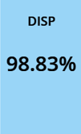
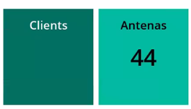

# 📊 Consultas SWQL (SolarWinds Query Language)

Este diretório reúne consultas otimizadas em SWQL para gerar relatórios, dashboards e métricas avançadas no SolarWinds.

## 📂 Exemplos de Consultas

| Nome do Arquivo | Objetivo |
|-----------------|----------|
| `disponibilidade-ultimo-mes.swql` | Retorna a porcentagem disponibilidade de uma interface no último mês |
| `Alertas+24horas.swql` | Alertas que estão alarmando mais de 24 horas |
| `Access-Points.swql` | Quantidade de Aps de uma determinada controller |

## 🧠 Sobre SWQL

SWQL é uma linguagem proprietária da SolarWinds baseada em SQL, otimizada para leitura do banco do Orion via API.

## 💡 Dica

Você pode testar essas consultas usando o **SolarWinds SWQL Studio** ou diretamente nos widgets de dashboard personalizados.

## 📷 Exemplos Visuais

disponibilidade ultimo mes

Alertas + 24 horas

Access-Points

## 🛑 Aviso

Evite utilizar SWQL diretamente em ambientes críticos sem validação prévia. Algumas consultas podem gerar carga elevada.

